# SwimNote User Flow

```mermaid
flowchart TB
    subgraph AppLaunch["App Launch"]
        Start([App Opens]) --> LoadProfiles[Load Profiles]
        LoadProfiles --> HasProfile{Has Active Profile?}
        HasProfile -->|Yes| MainTabs
        HasProfile -->|No| NeedsSetup{First Time?}
        NeedsSetup -->|Yes| WelcomeView[Welcome Screen]
        NeedsSetup -->|No| UserSelectionView[User Selection]
        WelcomeView -->|Get Started| UserSetupView[Create Profile]
        UserSetupView --> MainTabs
        UserSelectionView -->|Select Profile| MainTabs
        UserSelectionView -->|Add New| UserSetupView
    end

    subgraph MainTabs["Main Tabs (TabView)"]
        TabDashboard[Dashboard]
        TabCalendar[Calendar]
        TabVideo[Video Analysis]
        TabPlan[Planning]
        TabSettings[Settings]
    end

    subgraph Dashboard["Dashboard Flow"]
        TabDashboard --> LoadTodayNote[Load Today's Note]
        LoadTodayNote --> Header[Header: Profile Menu]
        Header -->|Switch User| UserSelectionView
        Header -->|Edit Profile| PersonalBestsEditor[Edit Profile]
        
        LoadTodayNote --> TrainingPlanCard[Today's Training Plan Card]
        TrainingPlanCard -->|Tap| PlanDetailSheet[Plan Detail Sheet]
        
        LoadTodayNote --> StrokeGrid[Stroke Cards Grid]
        StrokeGrid -->|Tap Stroke| TechniqueTree[Technique Tree View]
        
        LoadTodayNote --> DailyNoteEditor[Daily Note Editor]
        DailyNoteEditor --> GoalsSection[Goals Section]
        GoalsSection -->|Empty| EmptyGoalsPrompt["What do you want to focus on? Pick from strokes"]
        GoalsSection -->|Swipe Left| DeleteGoal[Delete Goal]
        GoalsSection -->|Tap Status| StatusMenu[Change Status Menu]
        GoalsSection -->|Tap Notes Icon| GoalNotesSheet[Add Goal Notes]
        
        DailyNoteEditor --> SessionNotes[Session Notes Field]
    end

    subgraph CalendarFlow["Calendar Flow"]
        TabCalendar --> WeekPicker[Week Picker]
        WeekPicker -->|Previous/Next| UpdateWeek[Update Week View]
        
        TabCalendar --> CalendarGrid[7-Day Calendar Grid]
        CalendarGrid --> DayCell[Day Cell]
        DayCell -->|Teal Indicator| HasPoolSession[Pool Session]
        DayCell -->|Orange Indicator| HasDryLand[Dry Land Exercise]
        
        CalendarGrid -->|Tap Day| DayDetailSheet[Day Detail Sheet]
        DayDetailSheet --> SessionSection[Pool Session Section]
        DayDetailSheet --> DryLandSection[Dry Land Section]
        DayDetailSheet --> GoalsList[Goals List]
        
        TabCalendar --> NoPlanCard[No Plan Card]
        NoPlanCard -->|Tap| SwitchToPlan[Switch to Plan Tab]
    end

    subgraph TechniqueFlow["Technique Tree Flow"]
        TechniqueTree --> NodeList[Sorted Node List]
        NodeList -->|Tap Node| NodeDetail[Node Detail View]
        
        NodeDetail --> TabPicker[Tab Picker]
        TabPicker --> OverviewTab[Overview]
        TabPicker --> KeyPointsTab[Key Points]
        TabPicker --> MistakesTab[Mistakes]
        TabPicker --> DrillsTab[Drills]
        TabPicker --> CompetitiveTab[Competitive]
        
        KeyPointsTab -->|Add +| AddKeyPointGoal[Add Key Point Goal]
        MistakesTab -->|Add +| AddMistakeGoal[Add Mistake Goal]
        CompetitiveTab -->|Add as Goal| TierSelection[Tier Selection Sheet]
        TierSelection --> AddCompetitiveGoal[Add Competitive Drill Goal]
        
        AddKeyPointGoal --> SaveToToday[Save to Today's Note]
        AddMistakeGoal --> SaveToToday
        AddCompetitiveGoal --> SaveToToday
        
        OverviewTab --> RelatedTechniques[Related Techniques]
        RelatedTechniques -->|Tap Link| NodeDetail
    end

    subgraph PlanningFlow["Planning Flow"]
        TabPlan --> WeekSelection[Week Starting Date]
        WeekSelection --> DatePicker[Date Picker]
        
        TabPlan --> GenerateButton[Generate Plan Button]
        GenerateButton --> LLMGeneration[LLM Plan Generation]
        LLMGeneration --> ToolCalls[Tool Calls: read_technique_file, get_user_profile]
        ToolCalls --> GeneratedPlan[Generated Weekly Plan]
        
        GeneratedPlan --> SessionsList[Session Cards List]
        SessionsList -->|Expand| SessionDetail[Session Detail View]
        SessionDetail --> WarmUpSegment[Warm-up Segment]
        SessionDetail --> DrillSegment[Drill Set Segment]
        SessionDetail --> MainSetSegment[Main Set Segment]
        SessionDetail --> CoolDownSegment[Cool-down Segment]
        
        GeneratedPlan --> DryLandCard[Dry Land Card]
        DryLandCard --> DryLandTiles[Dry Land Exercise Tiles]
        DryLandTiles -->|Auto Assign| AssignToRestDays[Assign to Rest Days]
        DryLandTiles -->|Manual| DateSelection[Select Specific Dates]
        
        GeneratedPlan --> SavePlanButton[Save Plan Button]
        SavePlanButton --> SaveToStorage[Save to JSON Storage]
        SaveToStorage --> CalendarRefresh[Calendar Tab Refreshes]
        
        TabPlan --> HistoryButton[History Button]
        HistoryButton --> PlanHistoryView[Plan History View]
        PlanHistoryView -->|Select Plan| LoadSavedPlan[Load Saved Plan]
    end

    subgraph HistoryFlow["History Flow"]
        TabHistory --> LoadHistory[Load Past Notes]
        LoadHistory --> NotesGrid[Notes Grid]
        NotesGrid -->|Tap Note| NoteDetail[Note Detail View]
        NoteDetail --> ViewGoals[View Goals]
        NoteDetail --> ViewNotes[View Session Notes]
    end

    subgraph VideoFlow["Video Analysis Flow"]
        TabVideo --> ImportButton[Import Video Button]
        ImportButton --> FilePicker[File Picker]
        FilePicker -->|Select Video| VideoPlayer[Video Player]
        VideoPlayer --> SavedAnalysis[Saved Analysis Records]
        
        TabVideo --> DemoButton[Demo Analysis]
        DemoButton --> SavedAnalysis
    end

    subgraph SettingsFlow["Settings Flow"]
        TabSettings --> LLMSection[LLM Provider Section]
        LLMSection --> ProviderPicker[Provider Picker]
        ProviderPicker --> ModelField[Model Name]
        ModelField --> APIKeyField[API Key]
        APIKeyField --> SaveConfig[Save Configuration]
        
        TabSettings --> iCloudSection[iCloud Sync Status]
    end

    subgraph ProfileManagement["Profile Management"]
        PersonalBestsEditor --> EditPBs[Edit Personal Bests]
        UserSetupView --> NameField[Name]
        UserSetupView --> BirthdayPicker[Birthday]
        UserSetupView --> SexPicker[Sex]
        UserSetupView --> PBsOptional[Personal Bests Optional]
        UserSetupView --> ProfileIcon[Profile Icon Picker]
        
        UserSelectionView -->|Swipe Edit| PersonalBestsEditor
        UserSelectionView -->|Swipe Delete| DeleteConfirm[Delete Confirmation]
    end
```

## Key User Flows

### 1. App Launch → Setup/Selection
- First-time users: Welcome Screen → Create Profile → Dashboard
- Returning users (no active profile): User Selection → Dashboard
- Returning users (active profile): Direct to Dashboard

### 2. Dashboard (Primary Tab)
- View today's training session
- Today's Training Plan card (tap to view full plan details)
- Navigate to stroke technique trees via stroke cards
- Manage daily goals:
  - Change status (Planned → In Progress → Achieved/Unable)
  - Add notes via notes icon
  - Delete via leftward swipe
- Empty goals prompt: "What do you want to focus on today? Pick from stroke cards above"
- Add session notes

### 3. Calendar Tab
- Week-based navigation (Monday to Sunday)
- 7-day calendar grid with:
  - Teal indicators for pool sessions
  - Orange indicators for dry land exercises
- Day detail sheet on tap:
  - Pool session summary (warm-up, drills, main set, cool-down)
  - Dry land exercises with sets/reps
  - Goals for that day
- No plan card when no training plan exists → links to Plan tab

### 4. Planning Tab
- Select week starting date
- Generate AI-powered training plan:
  - Reads user profile, personal bests, skill level
  - Reads technique files for stroke-specific guidance
  - Creates sessions with warm-up, drill sets, main sets, cool-down
  - Generates dry land exercises
- Session cards:
  - Expandable to show full session details
  - Date picker for scheduling each session
- Dry land scheduling:
  - Auto-assigned to rest days (days without pool sessions)
  - Manual date selection per exercise
- Save plan to storage (visible in Calendar tab)
- Plan history: browse and load previously saved plans

### 5. Technique Tree → Node Detail
- Browse technique nodes organized by stroke
- View detailed content across 5 tabs:
  - **Overview**: Description, difficulty, related techniques
  - **Key Points**: Checklist items → Add as goal
  - **Mistakes**: Common errors → Add as "Avoid" goal
  - **Drills**: Practice drills with descriptions
  - **Competitive**: Tiered targets (Beginner → Elite) → Add as goal with tier selection
- Navigate between related techniques

### 6. Video Analysis
- Import swim footage via file picker
- Video player for review
- Saved analysis records with metrics (kick rate, etc.)

### 7. Settings
- Configure LLM provider (OpenAI, Anthropic, OpenAI-Compatible)
- Set model name and API key
- View iCloud sync status

### 8. Profile Management
- **User Selection**: Switch profiles, edit, or delete
- **Create Profile**: Name, birthday, sex, personal bests (optional), profile icon
- **Edit Profile**: Update personal bests

## Screen Hierarchy

| Screen | Parent | Navigation Type |
|--------|--------|-----------------|
| WelcomeView | RootView | Conditional render |
| UserSetupView | RootView/UserSelectionView | Sheet |
| UserSelectionView | RootView/Dashboard/Calendar/Video | Sheet |
| DashboardView | TabView | Tab |
| TechniqueTreeView | DashboardView | NavigationLink |
| NodeDetailView | TechniqueTreeView | NavigationLink |
| CalendarView | TabView | Tab |
| DayDetailSheet | CalendarView | Sheet |
| TrainingPlanView | DashboardView/CalendarView | Sheet |
| VideoToolsView | TabView | Tab |
| PlanningView | TabView | Tab |
| PlanHistoryView | PlanningView | Sheet |
| SessionCard | PlanningView | Inline expand |
| DryLandCard | PlanningView | Inline |
| SettingsView | TabView | Tab |
| PersonalBestsEditor | Various | Sheet |
| TierSelectionSheet | NodeDetailView | Sheet |
| Goal Notes Sheet | DashboardView | Sheet |

## Component Architecture

Extracted components for maintainability:

| Component | File | Used In |
|-----------|------|---------|
| SessionCard | `Features/Planning/Components/SessionCard.swift` | PlanningView, TrainingPlanView |
| DryLandCard | `Features/Planning/Components/DryLandSection.swift` | PlanningView, CalendarView |
| DryLandSection | `Features/Planning/Components/DryLandSection.swift` | DayDetailSheet |
| PlanHistoryView | `Features/Planning/Components/PlanHistoryViews.swift` | PlanningView |
| DayCell | `Features/Calendar/Components/DayCell.swift` | CalendarView |
| GoalStatusBadge | `Components/GoalStatusBadge.swift` | GoalsListView, CalendarView |