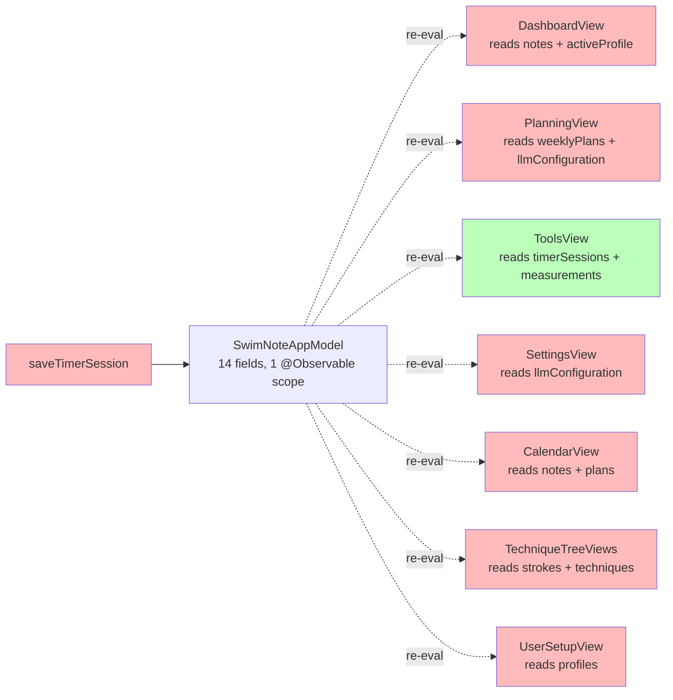
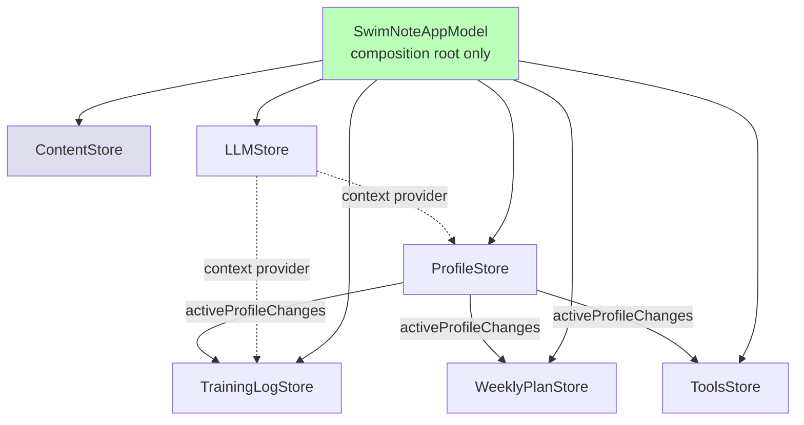

# RFC: SwimNoteAppModel Split

**Status:** Draft — Phase 3 of three-phase rollout. Planning artifact only; no code.
**Author:** SwimNote refactor track
**Created:** 2026-05-13
**Reviewers:** Repository owner

---

## TL;DR

`SwimNoteAppModel` has become a god-object: ~982 LOC, 7 repositories, 3
caches, 25+ public APIs, 14 published `@Observable` properties. Every view
in the app subscribes to it, so any mutation — saving a note, refreshing
the timer list, switching profiles — re-renders unrelated screens. We
propose splitting it into six focused `@Observable` stores composed by a
thin facade. Migration is one PR per store; the legacy facade stays in
place until the last store lands so every PR ends with a green build and
no view changes are required mid-migration.

---

## 1. Current state

### 1.1 What `SwimNoteAppModel` owns today

```mermaid
graph TB
    AppModel[SwimNoteAppModel<br/>982 LOC]

    subgraph "Published state (14 fields)"
        S1[strokes]
        S2[techniques]
        S3[notes]
        S4[profiles]
        S5[activeProfile]
        S6[needsSetup]
        S7[showingUserSetup]
        S8[selectedTab]
        S9[llmConfiguration]
        S10[videoRecords]
        S11[trainingPlans]
        S12[weeklyPlans]
        S13[measurements]
        S14[timerSessions]
    end

    subgraph "Private caches (3)"
        C1[sessionsByDate]
        C2[dryLandByDate]
        C3[parsedContentCache + treeCache]
    end

    subgraph "Repositories (7)"
        R1[noteRepository]
        R2[profileRepository]
        R3[planRepository]
        R4[weeklyPlanRepository]
        R5[measurementRepository]
        R6[timerSessionRepository]
        R7[outlineRepository]
    end

    subgraph "Other deps (3)"
        D1[contentLoader]
        D2[llmConfigurationStore]
        D3[credentialStore]
    end

    AppModel -->|owns| S1 & S2 & S3 & S4 & S5 & S6 & S7 & S8 & S9 & S10 & S11 & S12 & S13 & S14
    AppModel -->|owns| C1 & C2 & C3
    AppModel -->|delegates to| R1 & R2 & R3 & R4 & R5 & R6 & R7
    AppModel -->|delegates to| D1 & D2 & D3
```



### 1.2 The re-render fan-out problem



When `saveTimerSession` mutates `timerSessions`, every view that holds a
reference to `appModel` is re-evaluated by SwiftUI's tracking system —
not just `ToolsView`, which is the only consumer that cares. Body
re-evaluation is cheap when no actual state changed, but the dependency
graph lights up unnecessarily, making profiling noisy and tying every
new feature to the same monolithic context.

### 1.3 Public surface (selected — full list in `SwimNoteAppModel.swift`)

- Profile lifecycle: `loadProfiles`, `switchProfile`, `createProfile`
  (×2 overloads), `updateProfile`, `deleteProfile`, `seedDemoProfiles`
- Notes: `noteForToday`, `noteForDate`, `saveNote`, `reloadNotes`
- Plans: `saveWeeklyPlan` (×2), `weeklyPlanForDate`, `planForWeek`,
  `planForDate`, `loadOutline`, `saveOutline`
- Tools data: `reloadMeasurements`, `saveMeasurement`,
  `deleteMeasurement`, `reloadTimerSessions`, `saveTimerSession`,
  `deleteTimerSession`
- Content: `loadBundledContent`, `tree(for:)`, `markdown(filename:)`,
  `parsedTechnique(filename:)`
- LLM: `saveLLMConfiguration`, `generateFocusCues(for:stroke:)`,
  `createToolExecutor`
- Sessions: `sessionsForDate(_:)` (sync + async), `dryLandForDate`,
  plus the private `rebuildDateCaches`

Total public API count: ~25.

---

## 2. Target stores

Six `@Observable @MainActor` stores. Each owns a slice of state, exposes
a focused public surface, and depends on the smallest set of
repositories needed to back its slice.

### 2.1 ProfileStore

**Owned state**
- `profiles: [UserProfile]`
- `activeProfile: UserProfile?`
- `needsSetup: Bool`
- `showingUserSetup: Bool`

**Public surface**
```swift
func loadProfiles() async
func switchProfile(to profile: UserProfile) async throws
func createProfile(...) async throws -> UserProfile  // both overloads
func updateProfile(_ profile: UserProfile) async throws
func deleteProfile(id: String) async throws
func seedDemoProfiles() async -> Int
```

**Repository dependencies**
- `UserProfileRepository`

**Cross-store communication**
- Publishes `activeProfileDidChange(UserProfile?)` via a single
  `AsyncStream<UserProfile?>` exposed as `activeProfileChanges`. Other
  stores that need to react (TrainingLogStore, WeeklyPlanStore,
  ToolsStore) subscribe in their own `init`. No global notification bus.

---

### 2.2 TrainingLogStore

**Owned state**
- `notes: [TrainingNote]`
- `sessionsByDate: [String: [DetailedSession]]` (private cache)
- `dryLandByDate: [String: [DryLandExercisePlan]]` (private cache)

**Public surface**
```swift
func reloadNotes(userId: String) async
func noteForToday() async -> TrainingNote?
func noteForDate(_ date: String) async -> TrainingNote?
func saveNote(_ note: TrainingNote) async
func sessionsForDate(_ date: String) -> [DetailedSession]  // sync, cached
func sessionsForDate(_ date: String) async -> [DetailedSession]
func dryLandForDate(_ date: String) -> [DryLandExercisePlan]
```

**Repository dependencies**
- `TrainingNoteRepository`

**Cross-store communication**
- Subscribes to `ProfileStore.activeProfileChanges` and reloads / clears
  notes when the active profile flips. Re-emits no events of its own —
  views observe directly.

---

### 2.3 WeeklyPlanStore

**Owned state**
- `trainingPlans: [TrainingPlan]`
- `weeklyPlans: [WeeklyTrainingPlan]`

**Public surface**
```swift
func saveWeeklyPlan(_ plan: WeeklyTrainingPlan) async throws
func saveWeeklyPlan(_ weeklyPlan: WeeklyTrainingPlan, weekStarting: String) async throws
func weeklyPlanForDate(_ date: String) async -> WeeklyTrainingPlan?
func planForWeek(weekStarting: String) async -> TrainingPlan?
func planForDate(_ date: String) -> TrainingPlan?
func loadOutline() async -> WeeklyPlanOutline?
func saveOutline(_ outline: WeeklyPlanOutline) async throws
```

**Repository dependencies**
- `WeeklyPlanRepository`
- `TrainingPlanRepository`
- `OutlineRepository`

**Cross-store communication**
- Subscribes to `ProfileStore.activeProfileChanges`. When the active
  profile changes, reloads its own state from the new profile's repo
  scope.

---

### 2.4 ToolsStore

**Owned state**
- `videoRecords: [VideoAnalysisRecord]`
- `measurements: [TechniqueMeasurement]`
- `timerSessions: [TimerSession]`

**Public surface**
```swift
func reloadMeasurements(userId: String) async
func saveMeasurement(_ measurement: TechniqueMeasurement) async throws
func deleteMeasurement(id: String) async throws
func reloadTimerSessions(userId: String) async
func saveTimerSession(_ session: TimerSession) async throws
func deleteTimerSession(id: String) async throws
```

**Repository dependencies**
- `TechniqueMeasurementRepository`
- `TimerSessionRepository`

**Cross-store communication**
- Subscribes to `ProfileStore.activeProfileChanges`. Mutations are
  local-only; doesn't need to broadcast.

---

### 2.5 ContentStore

**Owned state**
- `strokes: [Stroke]`
- `techniques: [Technique]`
- `parsedContentCache: [String: ParsedTechniqueContent]` (private)
- `treeCache: [StrokeID: TechniqueTree]` (private)

**Public surface**
```swift
func loadBundledContent()
func tree(for strokeId: StrokeID) -> TechniqueTree?
func markdown(filename: String) -> String
func parsedTechnique(filename: String) -> ParsedTechniqueContent?
```

**Repository dependencies**
- `BundleContentLoader` (bundled; not a repo, but the same dependency
  shape — reads from app bundle resources).

**Cross-store communication**
- None. Bundle content is immutable per app version, so this store has
  no upstream subscriptions and emits no events.

---

### 2.6 LLMStore

**Owned state**
- `llmConfiguration: LLMConfiguration?`
- `selectedTab: AppTab` *(stays here for now since LLMStore already owns
  the settings flow; revisit during the AppRouter follow-up RFC)*

**Public surface**
```swift
func saveLLMConfiguration(_ configuration: LLMConfiguration?)
func generateFocusCues(for goal: Goal, stroke: StrokeID?) async -> [String]?
func createToolExecutor(referenceDate: Date?) -> CombinedToolExecutor
```

**Repository dependencies**
- `LLMConfigurationStore` (existing UserDefaults wrapper)
- `SecureCredentialStore` (existing)

**Cross-store communication**
- `createToolExecutor` needs profile + notes context. Two acceptable
  contracts:
  1. **Pull**: LLMStore holds weak references to ProfileStore and
     TrainingLogStore (passed at composition time) and pulls when
     building the executor.
  2. **Push**: composition root supplies a `ToolExecutorContextProvider`
     closure that LLMStore calls; the closure captures the other stores.

  Recommendation: option 2. Keeps stores decoupled in the dependency
  graph and lets tests inject any context.

---

### 2.7 Store dependency graph



Notes:
- ContentStore is a leaf — no upstream or downstream coupling.
- ProfileStore is the only publisher in the new design. All other
  stores either observe it or are independent.
- LLMStore reads context via an injected closure, never via direct
  store references, so it doesn't introduce a real edge.

---

## 3. Composition root

`SwimNoteAppModel` collapses to a thin assembly + bootstrap:

```swift
@Observable
@MainActor
public final class SwimNoteAppModel {
    public let profiles: ProfileStore
    public let trainingLog: TrainingLogStore
    public let weeklyPlans: WeeklyPlanStore
    public let tools: ToolsStore
    public let content: ContentStore
    public let llm: LLMStore

    public var isInitialized: Bool = false

    public static func makeDefault() async -> SwimNoteAppModel { ... }
}
```

Target size: **≤ 200 LOC** (vs 982 today).

Views consume stores via SwiftUI environment:

```swift
@Environment(ProfileStore.self) private var profiles
@Environment(TrainingLogStore.self) private var trainingLog
```

Each store gets its own `@Environment` slot at the app entry point. The
single `SwimNoteAppModel` reference is kept only for legacy call sites
during migration (see §4).

---

## 4. Per-feature migration sequence

**Concrete order, smallest-blast-radius first.** Each step is one PR
that ends with a green build. Until the last PR lands, every store is
also exposed via a forwarding facade on `SwimNoteAppModel` so views
that haven't been migrated yet keep compiling unchanged.

### Step 1: ProfileStore (smallest)

- New file `Stores/ProfileStore.swift`.
- Move profile state + 6 methods.
- Keep `appModel.profiles`, `appModel.activeProfile`, etc. as
  computed forwarders that read from `appModel.profileStore` (the
  facade).
- Migrate `UserSetupView`, `PersonalBestsEditor` to
  `@Environment(ProfileStore.self)`.
- All other views still hit `appModel.activeProfile` via the
  forwarder. No change to their bodies.

### Step 2: ContentStore (no upstream deps)

- Move bundle loading + caches.
- Migrate `TechniqueTreeViews`, `DashboardView` content reads.

### Step 3: ToolsStore (independent leaf)

- Move measurements + timerSessions + videoRecords.
- Migrate `ToolsView`, `SwimTimerView`, `TechniqueMeasurementView`,
  `VideoReviewView`.
- This is where re-render isolation pays off most visibly: the timer
  view stops triggering re-eval in the planning tab.

### Step 4: WeeklyPlanStore

- Move plans + outline.
- Migrate `PlanningView`, `TrainingPlanView`, `PlanHistoryViews`,
  `CalendarView` plan reads.
- **Coordinate with the hook-blocked PlanningView edits from
  P2-2C/P2-2G** — once those land separately, WeeklyPlanStore
  migration can pull the streaming wiring along.

### Step 5: TrainingLogStore

- Move notes + sessionsByDate + dryLandByDate caches.
- Migrate `DashboardView` notes reads, `CalendarView` notes reads.

### Step 6: LLMStore

- Move LLM config + focus cue generation + tool executor factory.
- Migrate `SettingsView`, `PlanningView` LLM reads.
- Wire the context-provider closure for `createToolExecutor`.

### Step 7: Cleanup

- Delete the forwarding facade.
- Confirm `SwimNoteAppModel.swift` is ≤ 200 LOC.
- Remove any now-unused `private var` caches.

---

## 5. Testing strategy

### 5.1 What becomes possible per store

| Store | New unit-testable behavior |
|-------|----------------------------|
| ProfileStore | Profile switching, demo seeding, active-profile invariant (no two active at once). |
| TrainingLogStore | Cache invalidation on profile change, sessionsByDate sort order (already covered partially in Phase 1). |
| WeeklyPlanStore | Plan id round-trip (already covered in Phase 1; expand to multi-week scenarios). |
| ToolsStore | Save/delete invariants for measurements + timer sessions in isolation from other state. |
| ContentStore | Cache hit/miss behavior with a fake `BundleContentLoader`. |
| LLMStore | Focus cue generation with an injected fake conversation; tool-executor context wiring. |

Each store gets its own `XCTestCase` / `Testing` struct. Repositories
are already protocol-driven, so injection is straightforward.

### 5.2 Transitional smoke test

Add `AppModelFacadeTests` that exercises every legacy property/method
on `SwimNoteAppModel` end-to-end through a fully-wired set of in-memory
stores. This test stays green throughout migration and gives us an
early signal if a forwarding shim drifts from the underlying store.

Once Step 7 (cleanup) lands, the facade tests are deleted and the
per-store tests carry forward.

---

## 6. Acceptance criteria

Measurable, all required for the RFC to be considered "done":

1. **Re-render isolation:** `TimerSession` save no longer triggers body
   re-evaluation in `PlanningView` or `DashboardView`. Verified by
   `_printChanges()` debug output or Instruments' SwiftUI tracking.
2. **CI runtime:** SwimNoteTests suite finishes in **≤ N seconds**
   where N is the current (pre-split) baseline. Target is no
   regression; nice-to-have is a 10–20% reduction from per-store
   parallelism in the test suite.
3. **`SwimNoteAppModel.swift` ≤ 200 LOC** at end-state (currently 982).
4. **Public-API parity:** every public method on the legacy
   `SwimNoteAppModel` resolves correctly via the new structure (either
   directly on a store or via deprecated forwarder). No view body in
   the app needs to change behavior, only its `@Environment` reads.
5. **Profile-switch behavior preserved:** switching profiles still
   reloads notes / plans / tools data within one frame, verified by an
   integration test driving `ProfileStore.switchProfile`.

---

## 7. Rollback plan

Every PR in §4 is independently revertable:

- Steps 1–6 each introduce a store and a forwarding shim. Reverting a
  single step removes only that store; the facade keeps the old
  behavior backed by the not-yet-extracted code, so views that already
  migrated to `@Environment(StoreX.self)` will fail to compile and
  block the revert. Mitigation: keep PRs small and revert via a new PR
  that re-inlines the migrated views at the same time.
- Step 7 (forwarder deletion) is the only irreversible step in
  isolation. Land it last, and only once §6 acceptance is fully met.
- The transitional facade itself is a deliberate insurance policy:
  even mid-migration, an emergency revert of any single store still
  leaves the app shipping the legacy behavior.

---

## 8. Out of scope for this RFC

These items are real work, but they don't belong in this split — each
will get its own focused RFC once §6 acceptance is met:

- File splits of `SwimModels.swift`, `PlanGenerationStrategy.swift`,
  `CombinedToolExecutor.swift`, `CoreDataRepositories.swift`.
- View splits of `PlanningView.swift`, `SwimTimerView.swift`,
  `DashboardView.swift`.
- `ToolName` enum + per-tool `Decodable` arg structs (waits for this
  AppModel split to land so the structs can live next to the right
  store).
- Markdown parse caching beyond what `ContentStore` already moves.
- View routing / tab management (`selectedTab` placement is
  provisional; an `AppRouter` may absorb it later).
- Localization, accessibility, design-system token cleanup.
- Core Data → background context migration.
- Streaming UI integration in `PlanningView` (P2-2G follow-up; coordinate
  with Step 4 WeeklyPlanStore migration).
- The hook-blocked items from Phase 2 (P2-2C call sites in
  `PlanningView`, P2-2D compact JSON in `CombinedToolExecutor`) — these
  are infrastructure issues, not architecture decisions, and must land
  before this RFC's Step 4 to avoid double-touching `PlanningView`.

---

## Sign-off

Reviewer notes go below this line. Once approved, this RFC graduates
into a per-step execution plan tracked in the same `docs/refactors/`
folder.
